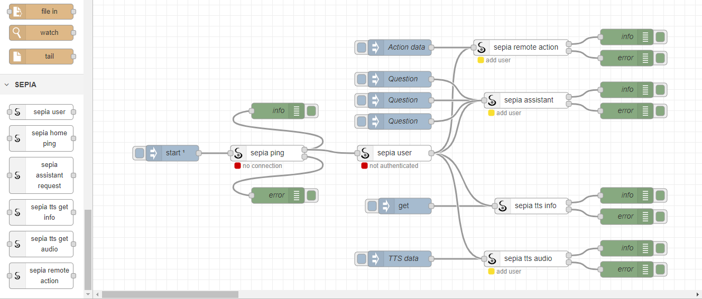

# sepia-node-js-client
Basic Node.js client for SEPIA with Node-RED support

## Node-RED Guide

### Installation

Make sure you have 'git' installed then (for a default Node-RED installation) do:

```
cd ~
git clone -b dev https://github.com/SEPIA-Framework/sepia-node-js-client.git
cd ~/.node-red
npm install ~/sepia-node-js-client
```

### Sample setups

<p align="center">
  
</p>

